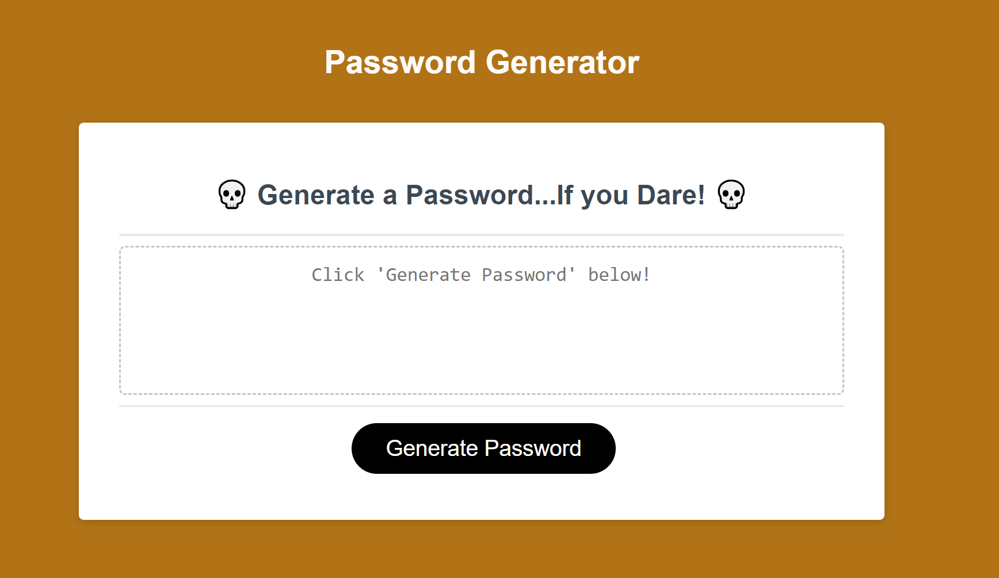

# Module 3 Challenge: Password Generator

## Description

This application generates a password for the user depending on certain criteria. The user can request a password from 8 to 128 characters in length. Additionaly, the user can choose to have the following included: Numbers, Symbols, Uppercase and Lowercase letters. The application is very useful for generating a secure password without the need to actually come up with it yourself! I learned the benefit of an if statement and also how arrays when coding. These are, of course, tools that I'll carry with me for my entire career and that excites me. I'm actually looking forward to using the password for my own benefit, since sometimes I'm lazy and heavily dislike thinking of my own password.

## Installation

No installation required! Simply click the "Generate Password" button, specify your parameters and you're golden!

## Usage

Provide instructions and examples for use. Include screenshots as needed.

To add a screenshot, create an `assets/images` folder in your repository and upload your screenshot to it. Then, using the relative filepath, add it to your README using the following syntax:

    ```md
    

    ```

## License

MIT License

